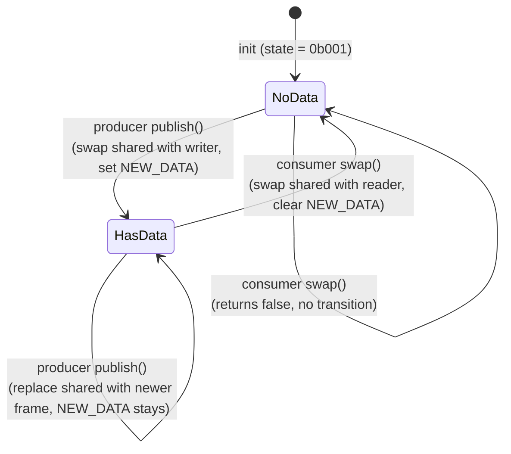
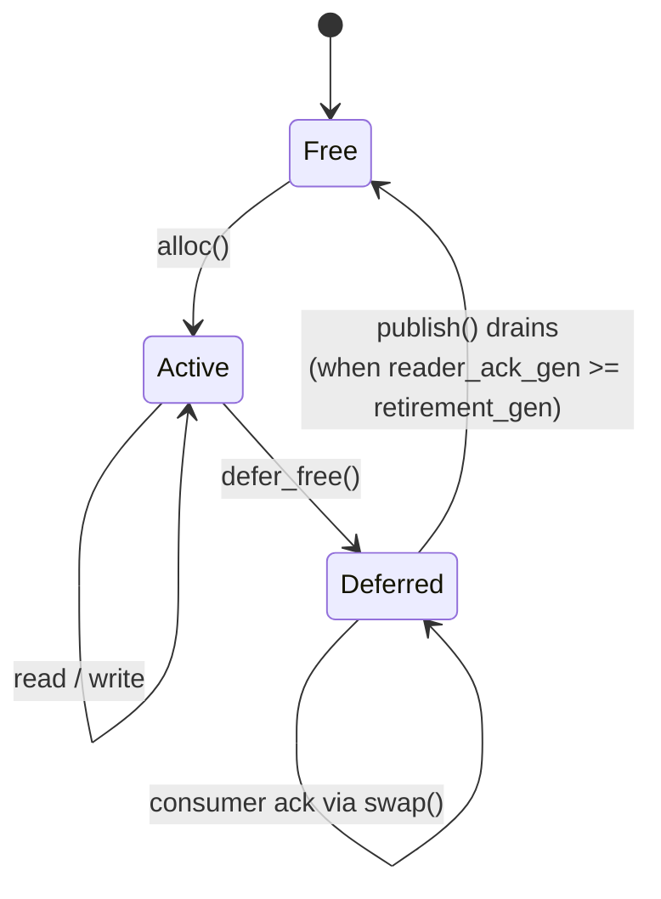
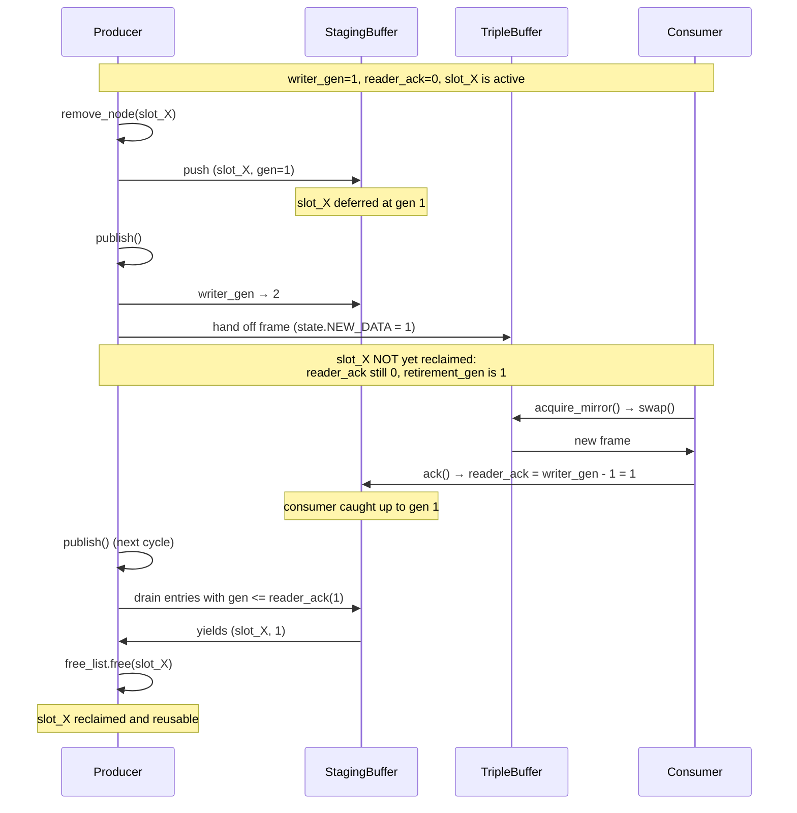

# synaptic-kernel — Architecture

## Purpose

A wait-free, lock-free SPSC (single-producer / single-consumer) graph kernel. One thread mutates a graph of nodes and
synapses; another thread traverses a consistent snapshot. Backing memory is a single flat `Arc<[AtomicI32]>`, addressed
entirely by integer offsets — no boxed nodes, no per-entity allocation. The whole kernel is bind-able onto pre-existing
memory and serializable to a flat `Vec<i32>`.

The kernel is deliberately schema-agnostic and topology-agnostic. It owns the primitive structures (node and synapse
slots, chain links, synapse adjacency lists) but does *not* impose a single graph shape. The same primitives compose
into a single linear chain, a forest of disjoint sub-chains, a pure synaptic graph with no chain links, or any mix.
The kernel does not know what the graph means, where playback or traversal "starts," or which slots are roots —
those are user concerns. Users also define the per-node and per-synapse metadata/attribute strides, and may spin up
additional triple buffers, entry stores, and LUTs alongside the kernel-internal node and synapse stores.

## Top-level types

- `Kernel<TB_COUNT, STORE_COUNT, LUT_COUNT>` — producer-side facade. Owns the buffer and lifecycle. Const generics fix
  the number of user-defined triple buffers, entry stores, and LUTs at compile time.
- `KernelConfig<...>` — declarative sizing: metadata capacity, network config, plus arrays of `TripleBufferDef`,
  `EntryStoreDef`, `LutDef`.
- `ControlPlane<...>` — `Arc`-shared between producer and consumer. Holds an `AtomicPtr<EpochMirror>` plus
  `(writer_generation, reader_ack_generation)` for hot-swap.
- `EpochConsumer<...>` — consumer-side facade. Wraps `Arc<ControlPlane>`. Each cycle: `acquire_mirror()` returns a
  ready-to-read `&EpochMirror`.
- `Epoch<...>` / `EpochMirror<...>` — paired writer/reader projections of the same memory layout. `Epoch` mutates;
  `EpochMirror` traverses. Always created together.
- `SerializedKernel<...>` — `(KernelConfig, Vec<i32>)`. Snapshot/restore unit.

`Kernel::get_control_plane()` returns the `Arc<ControlPlane>`. The consumer constructs `EpochConsumer::new(arc)` on its
own thread. That `Arc` is the only legal cross-thread bridge.

## Memory model — three planes

Every read and write lands in one of three planes. The plane determines visibility semantics, *not* which thread writes
it.

1. **MEM (direct) plane** — backing region of the global `AtomicBuffer`. Writes are immediately visible to the consumer.
   Used for: graph-level metadata, slot allocator state (free list, allocation bitmap, deferred-free staging buffer),
   and per-entry attributes.
2. **TB (triple-buffered) plane** — three rotating buffers per `TripleBufferWriter`. Producer writes to a private
   buffer; `publish()` hands it off; consumer's `swap()` picks it up. Used for: structural pointers (chain head,
   next/prev, synapse heads/tails), node/synapse "core" fields, optional user metadata, LUTs.
3. **Default TB vs user TBs** — there is exactly one kernel-internal default triple buffer (`TripleBufferId::DEFAULT`,
   `u16::MAX`). It carries the network's structural state. User-defined triple buffers are independent and publish on
   their own cadence.

The split between MEM and TB is the central design choice: structural changes need atomic visibility (publish/swap) so
the consumer never sees a half-linked chain. Attributes don't — they tolerate per-field racing because they are scalar
and idempotent, and the consumer just reads what's there.

## Data hierarchy

```
Kernel
└── Epoch (producer)  ──── shared backing memory ────  EpochMirror (consumer)
    ├── MemMetadataWriter                              ├── MemMetadataReader
    ├── TripleBufferWriterRegistry<TB_COUNT>           ├── TripleBufferReaderRegistry<TB_COUNT>
    │   ├── default_tb : TripleBufferWriter            │   ├── default_tb
    │   └── tbs[0..TB_COUNT]                           │   └── tbs[0..TB_COUNT]
    ├── NetworkWriter   (uses default_tb)              ├── NetworkReader
    │   ├── NodeStoreWriter                            │   ├── NodeStoreReader
    │   │   └── EntryStoreWriter (NODE_STRIDE=8)       │   │   └── EntryStoreReader
    │   └── EntryStoreWriter (SYNAPSE_STRIDE=8)        │   └── EntryStoreReader
    ├── EntryStoreWriterRegistry<TB_COUNT, STORE_COUNT> ├── EntryStoreReaderRegistry<...>
    └── LutWriterRegistry<TB_COUNT, LUT_COUNT>          └── LutReaderRegistry<...>
```

Every writer type has a corresponding reader type. Writer holds the canonical `mem_start_offset`/`tb_start_offset`;
reader is built via `to_reader()` and binds the same offsets. Memory layout is shared by construction, never duplicated.

## Memory layout (single AtomicBuffer)

```
Offset 0:  KERNEL_MAGIC  ("SYSC", 0x53595343)
Offset 1:  KERNEL_VERSION (0x01)
Offset 2:  Epoch begins
           ├── MemMetadata           (size = mem_metadata_size, power of 2)
           ├── TripleBufferRegistry  (default TB + user TBs, each 4 + 3*capacity)
           ├── Network               (Node chain MEM + Synapse store MEM)
           └── EntryStoreRegistry    (per-store: SlotAllocator + attr region)
```

Each TB carries its own intra-buffer layout for the structural plane (network's nodes + synapses, plus user stores/LUTs
that target that TB). The default TB layout:

```
TB[0..]:    nodes[0..node_capacity] of (NODE_STRIDE + node_meta_stride) i32
TB[...]:    synapses[0..synapse_capacity] of (SYNAPSE_STRIDE + synapse_meta_stride) i32
TB[...]:    user entry stores assigned to default TB
TB[...]:    user LUTs assigned to default TB
```

`NODE_STRIDE = SYNAPSE_STRIDE = 8` — one slot reserved.

The kernel itself reserves no fixed TB slot for a "root pointer" or any other entry point. Users that need a stable
entry point store its slot in `mem_metadata` (or in their own user-defined TB / store).

## Triple buffer protocol

`TripleBufferWriter` rotates three buffers. State packs `(shared_buffer_id, NEW_DATA flag)` into a single i32:

- bits 0-1: shared buffer ID ∈ {0,1,2}
- bit 2:    NEW_DATA flag

Initial state: `0b001` (shared=1, NEW_DATA=0). Producer owns 0, consumer owns 2.

`publish()` (producer): swap the shared buffer with the producer's buffer, set NEW_DATA, then sync (memcpy) the new
producer-owned buffer from the just-published one — so the producer always starts the next frame from the most recent
published state.

`swap()` (consumer): if NEW_DATA is unset, return false. Otherwise swap producer's old buffer back, clear NEW_DATA,
return true.

State machine on the NEW_DATA bit (the gate that decides whether a `swap()` succeeds):



Two publishes between consumer swaps coalesce — the consumer only ever sees the latest published frame, never an
intermediate one. This is the trade triple-buffering makes for no producer blocking: at most one frame of staleness,
intermediate frames may be skipped under producer pressure.

Atomic ordering:

- Writer publish: `AcqRel` swap on state.
- Reader swap: `Acquire` load on state, `AcqRel` swap.
- Buffer payload reads/writes use `Relaxed` — the publish/swap fence does the synchronization.

The protocol is wait-free in both directions: no spinning, no CAS retry, no allocation. Triple-buffer means stale data
is at most one frame old; consumer never reads a torn frame.

## Slot allocation and deferred deletion

Topology entities (nodes, synapses, entry-store entries) live at fixed slot indices, 1-based.

### Slot identity — `SlotId`

The public API uses `SlotId(NonZeroU32)` for every slot reference. The wrapped `NonZeroU32` makes "slot 0" literally
unrepresentable at the type level — the compiler enforces that any `SlotId` you hold is a real slot. The Option
sentinel for "no slot here" is `None`, naturally niche-optimized: `Option<SlotId>` is one `u32` (4 bytes), with `0`
encoding `None` and any non-zero value encoding `Some(SlotId)`.

Wire format remains i32 in the AtomicBuffer cells. Conversion is a bit-cast at the API boundary
(`SlotId::from_i32` on read, `SlotId::option_to_i32` on write). Neither direction loses information.

API typing of slot fields is asymmetric, matching what each field can legitimately hold:

| Field | Type | Why |
|---|---|---|
| Node `next_ptr`, `prev_ptr` | `Option<SlotId>` | None = end of sub-chain (real, valid state) |
| Node `outgoing_synapse_head` / `tail`, `incoming_synapse_head` / `tail` | `Option<SlotId>` | None = node has no synapses on that side |
| Synapse `outgoing_next_ptr` / `prev_ptr`, `incoming_next_ptr` / `prev_ptr` | `Option<SlotId>` | None = head/tail of node's synapse list |
| Synapse `source_ptr`, `target_ptr` | `SlotId` | Active synapse always has both wired; reading 0 indicates corruption (the getter `.expect()`s) |

The "always Some" fields use bare `SlotId` so callers don't write `.unwrap()` for an invariant the kernel already
guarantees. The "may be None" fields use `Option<SlotId>` so the type signature reflects what the field can actually
hold. The principle: return `Option<SlotId>` only where None is a meaningful, valid state.

Capacity throughout the slot allocator and entry stores is bounded by `u32::MAX` (`SlotId`'s natural range).
Constructors take `capacity: u32` so the bound is enforced at compile time. Stored internally as `usize` for
arithmetic and indexing; exposed as `usize` via `capacity()` accessors to match Rust stdlib idioms.

### Allocator structure

`SlotAllocator` composes three primitives:

- `SimpleFreeList` — embedded singly-linked free list with allocation bitmap. `alloc()` / `free()` are O(1).
- `Bitmap` — 32-bits-per-i32 packed bit array. Used twice: by the free list (allocation bit) and by the slot allocator (
  staging bit).
- `StagingBufferWriter` — generation-stamped SPSC ring buffer of pending frees.

Lifecycle:



A single `publish()` after `defer_free()` does **not** reclaim the slot. Reclamation requires the consumer to have
acknowledged the generation in which the slot was deferred — which is bracketed by *two* publish calls with a
consumer ack in between. Tests and downstream code that need slots actually returned to the free pool must drive
this full cycle, not just call `publish()` once.

`defer_free(slot)` itself pushes `(slot, current_writer_generation)` to the staging buffer and sets the staging bit.
The slot is unreachable for new allocations until:

1. `StagingBufferWriter::publish()` advances `writer_generation`.
2. The consumer's `StagingBufferReader::ack()` (called from `EpochMirror::swap()` via `NetworkReader::ack_generation()`)
   writes back `writer_generation - 1`.

When the producer next calls `publish()` and drains, only entries whose generation ≤ ack are reclaimed.

This is the central invariant that makes the whole graph safe: a slot the consumer might still be reading is *never*
given back to `alloc()` until the consumer has acknowledged a generation strictly newer than the one in which the slot
was retired.

Generations are i32 with wrapping arithmetic (`wrapping_sub`).

### Counts include deferred slots

`SlotAllocator::alloc_count()`, `EntryStoreWriter::len()`, `NodeStoreWriter::len()`, and the kernel-level
`Kernel::node_count()` / `Kernel::synapse_count()` all reflect the slot allocator's notion of "not currently in the
free list." That includes **slots in the deferred state**. After `remove_node(slot)` returns, the slot is deferred
but still counts. To assert "all slots are actually free again," drive a full publish → ack → publish reclamation
cycle and then check the count.

For "is this specific slot safe to read right now?" use `is_active(slot)` (or `is_allocated(slot)` for the broader
"has been handed out and not yet reclaimed" question). Counts answer a different question — accounting, not liveness.

### Staging buffer telemetry — `deferred_count()`

`SlotAllocator::deferred_count()` returns the number of slots currently sitting in the staging buffer waiting for
the consumer to acknowledge their retirement generation. Under steady state with a healthy consumer, this number
stays low (slots flow through deferred quickly). Under a stalled or slow consumer, it climbs — and continues climbing
until the consumer catches up via `acquire_mirror()` / `swap()`.

Use `deferred_count()` as a health metric. A persistently rising deferred count signals the consumer thread is
falling behind, even before any error surfaces. The `RingBufferError::Full` failure path on `defer_free` is
structurally unreachable under correct usage (proven by the bound `deferred_count ≤ allocated_count ≤ capacity`),
so by the time the producer would fail, things are already deeply wrong. Watch the metric instead of waiting for
the error.

## Entry store — the universal slotted container

Most things in this kernel are an `EntryStoreWriter`/`EntryStoreReader` pair. Every entry has three zones with
separately configurable strides:

- **core** — TB plane, fixed schema owned by the kernel (e.g. node next/prev pointers, synapse source/target).
- **meta** — TB plane, user schema, structural updates.
- **attr** — MEM plane, user schema, scalar attributes with no publish requirement.

`EntryWriter` exposes all three for writing. `EntryHandle` (also producer-side) treats core as read-only — used when the
caller can edit user fields but must not corrupt structural pointers. `EntryReader` is read-only on all three.

Entry stores can be bound to any triple buffer — default or user. The kernel uses two entry stores internally (nodes and
synapses, both on the default TB); users can add `STORE_COUNT` more.

Per-entry sizing on disk:

- MEM: `SlotAllocator::calculate_size_on_mem(capacity) + capacity * attr_stride`
- TB:  `capacity * (core_stride + meta_stride)`

### Consumer-side slot-read contract

Reading slots from the consumer side has three cases. Two are safe; one is not.

1. **Slot reached by traversal from a known-live entry slot, within the current cycle.** Safe. The consumer enters
   the graph at a slot it trusts (typically a user-designated root stored in `mem_metadata`) and walks chain links
   and synapse adjacency from there. Slots reached this way during one cycle (between two `swap()` calls) are stable
   for the remainder of that cycle.

2. **Slot whose liveness the producer-side code can prove locally.** Safe. In single-threaded test code that has
   *just allocated* a slot and has not called `remove_node` / `disconnect` / `grow` in between, no reclamation
   event has occurred — so the slot cannot have been reallocated to a different entity. Reading it directly via
   `get_node(slot)` is safe even though no traversal happened. This is the common pattern in unit tests.

3. **Slot cached across `swap()` calls, or any slot whose liveness cannot be locally proven.** **Unsafe.** After a
   `swap()`, the consumer has acknowledged a generation. The producer is then permitted to reclaim deferred slots
   and reallocate them. A slot index the consumer cached in cycle N may, by cycle N+1, refer to a different entity.
   The kernel cannot detect this — the read returns whatever bytes are now at that slot. Re-traverse from the entry
   slot every cycle.

The slot allocator's deferred-free protocol guarantees safety for cases (1) and (2). It does not protect (3); that's
caller discipline.

## Network — graph topology

`NetworkWriter` is the only domain-aware composite. It owns:

- A `NodeStoreWriter` — pool of node slots, each with `next_ptr` / `prev_ptr` fields that *may* be used to form
  doubly-linked sub-chains. The kernel does not maintain a global head, root, or registry of sub-chain heads —
  sub-chains are emergent from the link structure. Built on top of `EntryStoreWriter` with
  `core_stride = NODE_STRIDE = 8`.
- A flat `EntryStoreWriter` of synapses with `core_stride = SYNAPSE_STRIDE = 8`.

### Topology composition

The kernel provides two orthogonal organizing structures over the same node pool, and the user composes them:

- **Chain links** (`next_ptr` / `prev_ptr` on each node) — form doubly-linked sub-chains. Acyclic by construction:
  the only way to mutate links is through `insert_node`, `insert_node_after`, `insert_node_before`, and `remove_node`,
  all of which preserve invariants. Direct setters are `pub(crate)`.
- **Synapse graph** (`outgoing_*` / `incoming_*` heads/tails on each node + per-synapse adjacency pointers) — forms
  an arbitrary directed graph between nodes. Cycles allowed, multi-edges allowed.

Users build whatever shape they need with these two primitives:

| Topology                     | How                                                                                                    |
|------------------------------|--------------------------------------------------------------------------------------------------------|
| Single linear sequence       | One sub-chain via `insert_node` then `insert_node_after`. No synapses.                                 |
| Forest of sub-chains         | Multiple `insert_node` calls; extend each with `insert_node_after`. Optional synapses to connect them. |
| Pure synaptic graph          | Each node a singleton (no chain links). Use `connect` to wire them.                                    |
| SymphonyScript clip graph    | Each clip = one sub-chain. Clip-to-clip connections = synapses between clip-head nodes.                |
| Singleton + adjacency lookup | Single sub-chain plus cross-references via synapses between non-adjacent nodes.                        |

The kernel is indifferent. Reachability, "where to start," cycle detection, traversal order, component count — all
domain concerns owned by the consumer.

### Node core layout (8 i32 per slot)

Wire format (what's stored in the AtomicBuffer cells):

```
0: kind (high 8 bits)  | reserved flags (low 24 bits)
1: next_ptr            (chain)            — 0 wire = None at API
2: prev_ptr            (chain)            — 0 wire = None at API
3: outgoing_synapse_head                  — 0 wire = None at API
4: outgoing_synapse_tail                  — 0 wire = None at API
5: incoming_synapse_head                  — 0 wire = None at API
6: incoming_synapse_tail                  — 0 wire = None at API
7: reserved
```

API typing: every slot field above is `Option<SlotId>`. `kind` is `i32` (top 8 bits, range `[0, 256)`).

### Synapse core layout (8 i32 per slot)

Wire format:

```
0: kind (high 8 bits)  | reserved flags (low 24 bits)
1: source_ptr          (node slot)        — never 0 on an active synapse
2: target_ptr          (node slot)        — never 0 on an active synapse
3: outgoing_next_ptr   (in source's outgoing list)  — 0 wire = None at API
4: outgoing_prev_ptr                      — 0 wire = None at API
5: incoming_next_ptr   (in target's incoming list)  — 0 wire = None at API
6: incoming_prev_ptr                      — 0 wire = None at API
7: reserved
```

API typing: `source_ptr` and `target_ptr` return bare `SlotId` (the getter `.expect()`s — reading 0 indicates a
mid-construction or corrupted synapse). The four adjacency fields return `Option<SlotId>` (None = head/tail of
the per-node synapse list). `kind` is `i32`.

### Topology invariants

- Every active synapse participates in *two* concurrent doubly-linked lists: through its source's outgoing chain and its
  target's incoming chain.
- `connect()` allocates a synapse, sets all six pointers, splices into both source.outgoing and target.incoming. Updates
  head/tail on the target nodes.
- `disconnect_synapse()` defer-frees the synapse and patches all four sides of both lists, plus head/tail.
- `disconnect(source, target)` walks the source's outgoing list and disconnects every synapse pointing at target.
- `remove_node()` cascades: drains all outgoing then all incoming synapses (each via `disconnect_synapse`), then
  defer-frees the node and patches the sub-chain it belonged to. **This invariant lives in `NetworkWriter`,
  not `NodeStoreWriter` — `NodeStoreWriter::remove_node()` alone leaves dangling synapses.**
- `remove_chain(head_slot)` is a convenience: walks `next_ptr` from `head_slot` and calls `remove_node` on each.
  Removes a whole sub-chain and cascades all synapses incident to its nodes. Caller must pass a chain head — calling
  it on a mid-chain node removes only the suffix from that node onward and leaves the prefix dangling.
- Chain links are acyclic by construction (mutators preserve doubly-linked invariants; direct setters are
  `pub(crate)`). The synapse graph may contain cycles — `connect(A, B)` and `connect(B, A)` is permitted.
- `kind` (top 8 bits of `core[0]` on both nodes and synapses) is `[0, 256)`. The kernel does not interpret it; it's
  user-defined semantics.

## Publish / swap cycle

Producer side:

```
mutate (insert_node, connect, write attrs, etc.)
  ├── structural changes → default TB writer-buffer + slot allocator MEM
  └── attribute changes  → MEM directly (no publish needed)

Kernel::publish()
  ├── Epoch::publish()
  │   ├── NetworkWriter::publish()
  │   │   ├── NodeStoreWriter::publish()  → node SlotAllocator::publish()
  │   │   └── synapses.publish()           → synapse SlotAllocator::publish()
  │   ├── store_registry.publish_all()    → all user EntryStoreWriters
  │   └── default_tb.publish()             → triple-buffer hand-off
  └── reclaim deferred-deletion queue based on ControlPlane reader_ack_generation
```

User TB writes call `Kernel::publish_tb(id)` independently — they don't pay the full structural cost.

Consumer side:

```
EpochConsumer::acquire_mirror()
  ├── ControlPlane::acquire_mirror()
  │   ├── ack(): reader_ack_generation := writer_generation
  │   └── load mirror_ptr (Acquire)
  └── EpochMirror::swap()
      ├── default_tb.swap()
      └── network.ack_generation()   → node + synapse staging-buffer acks
```

User TB swaps are explicit: the consumer must call `EpochMirror::swap_tb(id)` per cycle if it cares about that TB.
`acquire_mirror()` only handles the default TB.

Cross-thread interaction over a deferred-reclamation cycle:



Two independent generation tracks:

- **Slot reclamation generation** — per `StagingBuffer`. Producer increments on `publish`, consumer acks on `swap`.
  Keeps deferred slots unreachable for new allocations until consumer has moved past them.
- **Epoch generation** — per `ControlPlane`. Producer increments on `swap_epoch` (only fires during `grow()`). Consumer
  acks on `acquire_mirror`. Keeps the old `EpochMirror` box alive in the kernel's `readers_pending_deletion` queue until
  the consumer has moved past the swap.

The two are independent because they protect different things: per-store generations keep individual slots safe; the
epoch generation keeps the entire memory layout safe across `grow()`.

## Hot-swap and grow

`Kernel::grow(new_config)`:

1. Validate that every dimension in `new_config` is `>= current` (capacities, mem_metadata_size, all TB capacities, all
   store capacities, all LUT sizes). Return `InsufficientCapacity` otherwise.
2. All schema fields (strides, tb_id assignments) must match between old and new config; only capacities may grow.
   Schema mismatch returns KernelError::SchemaMismatch; capacity shrinkage returns KernelError::InsufficientCapacity.
3. Allocate a new `AtomicBuffer` sized for the new config; stamp the magic and version headers.
4. `Epoch::new` on the new buffer.
5. `Epoch::copy_from(old)` — element-wise atomic copy of mem_metadata, TB metadata regions, network MEM+TB, all entry
   stores, all LUTs.
6. `EpochMirror::bind` on the new epoch.
7. `ControlPlane::swap_epoch(new_mirror)` atomically swaps the `AtomicPtr` and increments writer_generation. Returns the
   old mirror with its retirement generation.
8. Push `(old_mirror, gen)` onto `readers_pending_deletion`.
9. Subsequent `publish()` calls drain `readers_pending_deletion` once `reader_ack_generation` has caught up.

The old `AtomicBuffer` is held only via `Arc` clones inside the old `Epoch`/`EpochMirror`. Once the mirror is dropped
from the deletion queue, the `Arc` count drops to zero and the buffer is freed.

### `grow()` is monotonic — there is no `shrink()`

Every dimension in the new config must be `>=` the old: `node_capacity`, `synapse_capacity`, `mem_metadata_size`,
each per-TB `buffer_capacity`, each per-store `capacity`, each per-LUT `size`. Passing a smaller value for any of
these returns `KernelError::InsufficientCapacity` and the kernel is unchanged. Schema fields (strides, `tb_id`
assignments) must be identical between old and new — see step 2 above.

This is intentional. `grow()` is an escape hatch for cases where the user under-sized the initial config; it is not
a steady-state resize mechanism. There is no plan to add `shrink()`. Long-running kernels with churn accumulate
capacity they paid for once and cannot release. Size the initial config with this in mind: pick a capacity that
covers your steady-state working set, and leave headroom only as much as you might need on a single grow event.

## Const-generic registries

`TripleBufferWriterRegistry<N>`, `EntryStoreWriterRegistry<TB_COUNT, STORE_COUNT>`,
`LutWriterRegistry<TB_COUNT, LUT_COUNT>` all share the same shape:

- IDs are values in `[0, N-1]`. The user assigns each definition an ID in any order.
- The registry maintains an `id_index: [u16; N]` lookup table mapping ID → array slot, validated for uniqueness and
  range at construction.
- `TripleBufferId::DEFAULT` (`u16::MAX`) is reserved — it's the kernel's own structural TB and never appears in
  user-supplied `tb_defs`.
- Entry stores and LUTs declare which TB they live on via `tb_id`. A store/LUT may target either the default TB or any
  user TB. Layouts compute per-TB cursor offsets so multiple entities can coexist in one TB.

This is why `EntryStoreWriterRegistry` carries `extra_tb_start_offsets: [usize; TB_COUNT]` and
`extra_tb_end_offsets: [usize; TB_COUNT]` — each user TB gets its own intra-buffer cursor.

## Construction modes — `new` vs `bind`

Every primitive that backs a memory region exposes two constructors plus one private `create(..., bind: bool)`:

- `new(...)` — zero-initializes the region. First-time construction.
- `bind(...)` — assumes the region already holds valid state. Used during `Kernel::load_serialized` and the writer-side
  replay after a mid-publish snapshot.

`TripleBufferWriter::bind` does an `Acquire` load on `state` to pick up the last published frame, then re-syncs the
writer buffer from the published one. Without that step, the rebound writer would start from stale buffer 0 and lose
updates.

`Kernel::load_serialized` checks magic and version against the buffer's first two i32 slots before binding.

## Threading rules

These are not enforced by the type system; they are documented contracts. Violating them is undefined behavior.

- Producer thread only: everything on `Kernel`, `Epoch`, all `*Writer` types.
- Consumer thread only: `EpochConsumer`, `EpochMirror`, all `*Reader` types.
- The `Arc<ControlPlane>` is the *only* object passed between threads. Producer drops its handle last.
- The consumer must be fully quiesced before `Kernel` is dropped or `serialize()` is called. Drop unconditionally frees
  the deletion queue; serialize captures memory mid-flight.
- In debug builds, `Kernel::drop` asserts `Arc::strong_count(&control_plane) == 1` and panics if any
  `EpochConsumer` (or external `Arc<ControlPlane>` clone) is still alive. Release builds skip the check; the contract
  still applies and violating it is undefined behavior. The recommended pattern is `consumer_thread.join()` before
  `drop(kernel)`, or declare the consumer after the kernel so reverse-declaration drop order handles it
  automatically.

The atomic ordering choices:

- `Relaxed` everywhere by default. Most reads and writes are protected by a coarser fence somewhere upstream.
- `Acquire`/`Release` on `pending_count` in `RingBuffer`, on `reader_ack_generation` in `StagingBuffer`, on `state` in
  `TripleBufferWriter`/`TripleBufferReader`, on `writer_generation`/`reader_ack_generation` in `ControlPlane`.
- `AcqRel` on triple-buffer state swaps and on `ControlPlane::swap_epoch`.

The three-level synchronization stack:

```
ControlPlane.writer_generation     ← whole-epoch handoff (grow)
  └── TripleBuffer.state           ← per-frame handoff (publish)
        └── StagingBuffer.gen      ← per-slot reclamation
```

## What is *not* in this kernel

- No allocation in the hot path. `alloc` and `dealloc` happen only inside `Kernel::new`, `load_serialized`, `grow`, and
  `Box::new`/`Box::from_raw` for the mirror swap.
- No queue for inserts. Insert and remove operations are immediate; their visibility is gated by `publish()`.
- No retry loops. SPSC + triple-buffer means the producer never spins.
- No type safety on entity payloads. Everything is `i32`. `IntoArray<STRIDE>` is a marker trait, but the kernel itself
  doesn't use it — it's there for consumers to wrap their own structs.
- No bounds-checking in release: most assertions are `debug_assert!`. Hot path is unchecked.

## Failure modes — what can go wrong

- `KernelError::CapacityExhausted` from `insert_*` / `connect` → slot allocator full. Caller must `publish` and let the
  consumer ack so deferred slots can be reclaimed, then retry.
- `SlotAllocatorError::InvalidSlot` / `DoubleFree` from `remove_node` / `disconnect*` → caller bug.
- `RingBufferError::Full` from `defer_free` → staging buffer overflow. Means the producer is retiring slots faster than
  the consumer is acknowledging, and the staging buffer's capacity (= entry store capacity) was exceeded. Should not
  happen if entity count ≤ store capacity.
- `KernelError::InsufficientCapacity` from `grow` → some capacity dimension in `new_config` is smaller than the old
  (`node_capacity`, `synapse_capacity`, `mem_metadata_size`, per-TB `buffer_capacity`, per-store `capacity`, or
  per-LUT `size`). `grow` is monotonic — only expansion is supported.
- `KernelError::SchemaMismatch` from `grow` → `new_config` differs from old in a non-capacity field: any
  `NetworkConfig` stride (`node_meta_stride`, `node_attr_stride`, `synapse_meta_stride`, `synapse_attr_stride`); any
  per-store `tb_id`, `core_stride`, `meta_stride`, or `attr_stride`; any per-LUT `tb_id`; or any TB / store / LUT
  ID present in old but missing from new. Schema must match exactly between old and new; only capacities may grow.
- Torn writes — if `serialize()` is called concurrently with consumer `swap()`, the snapshot may capture a triple buffer
  mid-rotation. The doc explicitly requires consumer quiescence before `serialize()` or drop.
